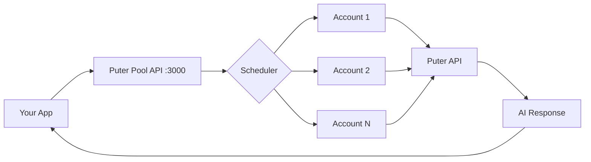

# Puter Pool — Free AI API with No Limits 🚀

<p align="center">
  
</p>

<p align="center">
  <strong>Get a free AI API</strong> for <strong>Claude Opus 5</strong>, <strong>GPT-5.6 Sol</strong>, <strong>Gemini 3.7 Flash</strong>, DeepSeek V4, Qwen, Llama, Mistral, Grok and <strong>400+ models</strong> by pooling free Puter accounts.<br />
  <strong>Unlimited credits</strong> — no card, no rate limits, no token costs.
</p>

<p align="center">
  <a href="https://puterpool.parithosh.workers.dev"><strong>🌐 Live Landing</strong></a> •
  <a href="http://localhost:5173"><strong>🛠️ Local Depot Dashboard</strong></a> •
  <a href="http://localhost:3000"><strong>🔌 Local API</strong></a> •
  <a href="https://github.com/Parithosh-Varma/puter-pool"><strong>📦 Repository</strong></a>
</p>

<p align="center">
  <a href="#features">Features</a> •
  <a href="#quick-start">Quick Start</a> •
  <a href="#how-it-works">How It Works</a> •
  <a href="#api">API</a> •
  <a href="#dashboard">Dashboard</a> •
  <a href="#docker">Docker</a> •
  <a href="#testing">Testing</a>
</p>

---
## How it works
Basically this tool helps you exploit puter free 0.25$ ai credits, and pool them to a api endpoint which is compatible for openAI as well as Anthropic which you can use for your coding agents such as opencode etc

## ✨ Features

| Feature | Description |
|---------|-------------|
| **Free AI API** | OpenAI at `/v1/chat/completions` + Anthropic at `/v1/messages`, `/anthropic/v1/messages` (all SSE streaming) |
| **400+ Models** | Live from Puter — Claude Opus 5, GPT-5.6 Sol, Gemini 3.7 Flash, DeepSeek V4, Mistral, Qwen, Grok, Llama… grouped by lab with LobeHub icons |
| **Unlimited Credits** | Automatic failover across accounts — never hit a cap |
| **Local by Design** | Depot runs on `localhost` only; tokens never leave your machine. Landing is static on Cloudflare Workers |
| **Industrial UI** | Depot dashboard with `P` logo (`#0C0F12` ink + `#FF3B1F` signal + `#FDB813` bolt), rail conveyor, health rail, queue meter, request tape, live traffic chart |
| **Smart Scheduler** | Round-robin or least-used strategy, retries up to `MAX_RETRIES=3`, parks exhausted/error accounts via HealthChecker |
| **Local SQLite** | `data/pool.db` via `node:sqlite` — auto-created, zero config |
| **Docker Ready** | `docker compose up -d` persists `./data` + `./logs` |

---

## 🎬 Demo

<p align="center">
  <video src="assets/demo.mp4" width="800" controls="controls" title="Puter Pool Demo"></video>
</p>

*Watch the dashboard in action: account rack, live chat, health rail, queue meter, and request tape.*

---

## 🚀 Quick Start

### Prerequisites
- Node.js 20+
- npm or pnpm
- (Optional) Docker & Docker Compose

### 1. Clone & Install

```bash
git clone https://github.com/Parithosh-Varma/puter-pool.git
cd puter-pool
cp .env.example .env   # SQLite at data/pool.db by default — no config needed
npm install && npm run build && npm start
```

### 2. Start Dashboard (separate terminal)

```bash
cd dashboard && npm install && npm run dev
# → Tool: http://localhost:5173 (no auth, localhost-only)
# → API:  http://localhost:3000  (landing stays on Cloudflare)
```

### 3. Add Puter Accounts

1. Create free accounts at [puter.com](https://puter.com)
2. Get your token from browser DevTools → Application → Local Storage → `puter.com` → `auth_token`
3. Paste tokens in the Depot UI at `http://localhost:5173`

---

## ⚙️ How It Works



1. **Create multiple Puter accounts** (free at puter.com) — each gives daily AI credits
2. **Paste tokens in Depot** at `http://localhost:5173` — health + credit tracked per account
3. **Point any SDK** at one endpoint — OpenAI `POST /v1/chat/completions` or Anthropic `POST /v1/messages`
4. **Scheduler shunts** — `round-robin` or `least-used`, retries up to `MAX_RETRIES=3`, parks `exhausted`/`error` bays via `HealthChecker`
5. **Uninterrupted** — pool handles rotation transparently, tape logs every request

---

## 🔌 API Reference

### Proxy Endpoints (Same Pool, Same Failover)

| Method | Endpoint | Format | Description |
|--------|----------|--------|-------------|
| `POST` | `/v1/chat/completions` | OpenAI | `{model, messages, stream, max_tokens, temperature}` |
| `POST` | `/v1/messages` | Anthropic | `{model, max_tokens, messages, system, temperature, stream}` |
| `POST` | `/anthropic/v1/messages` | Anthropic (alt) | SDK `baseURL: "/anthropic"` |
| `POST` | `/anthropic/messages` | Anthropic (alt) | |
| `GET` | `/v1/models` | OpenAI | Live model list from Puter |
| `GET` | `/healthz` | — | Liveness probe |
| `GET` | `/readyz` | — | Readiness (503 if 0 active accounts) |

### App Endpoints

| Method | Endpoint | Description |
|--------|----------|-------------|
| `POST` | `/api/ai/chat` | Auto-routed `{model, prompt, stream}` |
| `GET` | `/api/models` | Puter models (RSS + details) |
| `GET` | `/api/accounts` | List with health + credit (token redacted) |
| `POST` | `/api/accounts` | Add account `{name, token, dailyCreditLimit}` |
| `DELETE` | `/api/accounts/:id` | Remove account |
| `PATCH` | `/api/accounts/:id` | Update `{status, token, name}` |
| `GET` | `/api/stats` | Pool + scheduler stats |
| `GET` | `/api/dashboard` | Full UI data payload |
| `GET` | `/api/history?limit=100` | Request history |

---

### Quick Examples

**OpenAI curl**
```bash
curl http://localhost:3000/v1/chat/completions \
  -H "Content-Type: application/json" \
  -d '{"model":"claude-opus-5","messages":[{"role":"user","content":"Hello"}]}'
```

**Anthropic curl**
```bash
curl http://localhost:3000/v1/messages \
  -H "Content-Type: application/json" \
  -H "x-api-key: ignored" -H "anthropic-version: 2023-06-01" \
  -d '{"model":"claude-opus-5","max_tokens":1024,"messages":[{"role":"user","content":"Hello"}]}'
```

**OpenAI SDK (Python)**
```python
from openai import OpenAI
client = OpenAI(base_url="http://localhost:3000/v1", api_key="ignored")
print(client.chat.completions.create(
    model="gpt-5.6-sol",
    messages=[{"role":"user","content":"Hello"}]
).choices[0].message.content)
```

**Anthropic SDK (Python)**
```python
import anthropic
c = anthropic.Anthropic(base_url="http://localhost:3000", api_key="ignored")
print(c.messages.create(
    model="claude-opus-5",
    max_tokens=1024,
    messages=[{"role":"user","content":"Hello"}]
).content[0].text)
```

---

## ⚙️ Configuration

Full options in `.env.example`. Key variables:

| Variable | Default | Description |
|----------|---------|-------------|
| `PORT` | `3000` | API server port |
| `SQLITE_PATH` | `data/pool.db` | Local SQLite file (auto-created) |
| `SCHEDULER_STRATEGY` | `round-robin` | `round-robin` \| `least-used` |
| `MAX_RETRIES` | `3` | Accounts to try before returning 5xx |
| `HEALTH_CHECK_INTERVAL_MS` | `60000` | Re-verify account health interval |
| `REQUEST_TIMEOUT_MS` | `30000` | Per-request timeout |
| `LOG_LEVEL` | `info` | Logging verbosity |

---

## 🛠️ Dashboard

`http://localhost:5173` — **TOOL · LOCALHOST ONLY** (no login required)

- 💬 **Chat** with any model (streaming)
- 📦 **Account Rack** — add/enable/disable/delete cartridges
- 📊 **Metrics** — health / credit / latency / errorRate / consecutiveFailures
- 🚂 **Queue Rail** (128 slots) + live tape + traffic chart
- ⚙️ **Strategy Switch** — round-robin ↔ least-used

---

## 🗄️ Database

Local SQLite at `SQLITE_PATH` (`data/pool.db`) via `node:sqlite` — auto-created on first run.

- Tables: `puter_accounts` + `ai_responses`
- Mounted in Docker at `./data`
- Reference schema: `supabase-schema.sql`

---

## 🐳 Docker

```bash
docker compose up -d   # uses data/pool.db, no env needed
```

Persists:
- `./data` → SQLite database
- `./logs` → Application logs

---

## ☁️ Landing Page (Separate Deploy)

Static Vite app at `/landing` (gitignored), deployed to Cloudflare Workers:

```bash
cd landing && npm install && npm run build
source ~/bin/load-env.zsh  # CLOUDFLARE_API_TOKEN + CLOUDFLARE_ACCOUNT_ID
npx wrangler deploy        # → https://puterpool.parithosh.workers.dev
```

Features: Hero with curl examples, 400+ models grouped by lab (live RSS), how-it-works animation, API docs, comparison table, local steps, FAQ — LobeHub CDN icons + custom depot SVGs.

---

## 🧪 Testing

```bash
npm test              # 54 tests (Vitest)
npm run test:coverage # With coverage report
npm run typecheck     # TypeScript strict check
npm run build         # Verify compilation
```

---

## 📁 Project Structure

```
puter-pool/
├── src/                 # Core TypeScript modules
│   ├── accounts/        # Account management
│   ├── scheduler/       # Round-robin / least-used
│   ├── health/          # HealthChecker
│   ├── proxy/           # OpenAI + Anthropic proxies
│   ├── db/              # SQLite layer
│   └── index.ts         # Entry point
├── dashboard/           # React + Vite depot UI
├── landing/             # Cloudflare Workers landing (gitignored)
├── tests/               # Vitest suites
├── data/                # SQLite (mounted in Docker)
├── logs/                # Application logs
├── assets/              # Demo video, screenshots (gitignored)
└── logo.png             # Brand assets
```

---

## 🤝 Contributing

1. Fork the repo
2. Create a feature branch: `git checkout -b feat/amazing-feature`
3. Run checks: `npm run typecheck && npm test && npm run build`
4. Commit: `git commit -m 'feat: add amazing feature'`
5. Push and open a PR

---

## 📄 License

Apache-2.0 — see [LICENSE](LICENSE) for details.

---

## 🙏 Acknowledgements

- [Puter](https://puter.com) — for the free AI credits
- [LobeHub](https://github.com/lobehub/lobe-chat/tree/main/public/icons-static-svg) — for provider icons
- [Vite](https://vitejs.dev) + [React](https://react.dev) — for the dashboard
- [Cloudflare Workers](https://workers.cloudflare.com) — for the landing deployment
